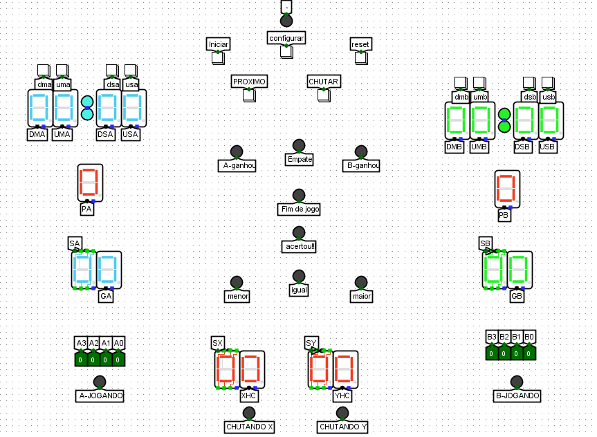

# Guess the number extreme

Participantes:

- Claylton Demésio Muniz Silva
    
    [https://github.com/Claylton-Muniz](https://github.com/Claylton-Muniz)
    
- Paulo Victor Santos Souza
    
    [https://github.com/PauloVict0r](https://github.com/PauloVict0r)
    

(obs. deixe a frequência de pulso baixa, normalmente em 1 ou 2 Hz, frequências muito altas podem causar bugs no circuito mesmo com a utilização do circuito de atraso ‘timer’ criado pela equipe)

Aqui está uma imagem que ilustra o estado atual do projeto:

Nela estão representados alguns botões, incluindo os de iniciar, reset, configurar, chutar e próximo. A primeira etapa do jogo é configurar os cronômetros dos jogadores, e essa parte do processo é realizada pelos seguintes componentes:

# Cronômetro:

Ao clicar em 'configurar', um sinal é enviado para os cronômetros do Jogador 1 e Jogador 2, ativando/desativando um flip-flop do tipo D que fornece uma indicação de qual flip-flop está ativo para acender o LED '-' do jogo. Isso também permite a modificação dos cronômetros através das entradas USP, DSP, UMP e DMP. Caso o botão iniciar seja pressionado então o start liga um flip-flop iniciando a partida e ligando a saída ‘running’. Essa partida não pode ser parada a não ser que seja resetado e cortando a o sinal da configuração assim não permitindo mais que o cronômetro seja configurado. Como podemos ver abaixo:

cronometro_p1:

O cronometro utiliza de dois circuitos chamado crono_60 onde um está sendo mandado um clock e o outro recebe um clock cada vez que o outro zera.

cronometro_p2:

crono_60:

O cronometro 60 utiliza os circuitos cont_reg_9 e cont_reg_5 que são circuitos quase exatamente iguais só que um conta de 9 a 0 e outro de 5 a 0, e quando um está em 9 e muda para 0 ele manda um pulso de clock, do mesmo modo o de 5 a 0.

cont_reg_9:

Cada fez que um clock é mandado o circuito Num_Regra_9 analisa as saídas de Q e controla as entradas dos flip-flops tipo D

cont_reg_5:

Cada fez que um clock é mandado o circuito Num_Regra_5 analisa as saídas de Q e controla as entradas dos flip-flops tipo D

Num_Regra_9:

Além de controlar as saídas ele verifica se ele estava no 0 e guarda na memória, então se ele chega no 9 e estava no 0 então ele manda um pulso de clock para a troca.

Num_Regra_5:

Além de controlar as saídas ele verifica se ele estava no 0 e guarda na memória, então se ele chega no 5 e estava no 0 então ele manda um pulso de clock para a troca.

Para que os dois cronometros sejam configurandos ao mesmo tempo nos ultilizamos o seguinte componente, que se conecta nas entradas dos cronômetos do player 1 e do player 2:

# Mudança dos players e do chute:

Quando o jogo está rodando, ou seja, o ‘running’ está ativado ele permite que as saídas ‘A-Jogando’, ‘B-Jogando’, ‘Chutando X’ e ‘chutando Y’ sejam ligadas. As saídas dos players que estão jogando vão depender da saída p2, se o p2 não está ativo, então ele manda um sinal para o A-jogando, se o p2 está ativo então ele manda um sinal para B-jogando. Enquando isso, utilizamos um flip-flop tipo D para definir se o chute é em x ou em y, se o flip-flop está em ~Q então ele manda um sinal para  ‘Chutando X’, e quando clicamos em próximo então ele manda um sinal para ‘Chutando Y’ e se ‘Chutando Y‘ está ativado, clicamos em próximo e o sinal de ‘ok’ que é responsável por acender os leds de comparação está ativado, então mudamos o player que está jogando, para evitar erros utilizamos um circuito time, pois as informações geradas são mais rápidas do que o tempo que uma pessoa demora para soltar o clique de um botão, então se ele não fosse utilizado uma ação que ainda não queriamos que acontecesse aconteceria. 

O circuito responsável por ativar o ‘ok’ é este:

situação:

Se o chutando y está desativado e clicamo proximo, então ele dá a mesma saída do proximo, se ele está ativado e clicamos em próximo o primeiro flip-flop ativa ligando o ok e se o ok está ligado e clicamo em próximo, então ele desliga o ok e dá a mesma saída do proximo.

time:

o time verifica se o sinal que foi mandado já sumiu e aí depois disso ele manda o sinal rápidamente.

# Valores escolhidos:

Como visto na inlustração do projeto temos de A3 até A0 no player 1 e de B3 até B0 no player 2. Esses valores da inlustração são jogados em um circuito chamado ‘Num_regra’ que verifica os 4 bits e diz qual a representação deles na casa dos inteiros de -8 a 7, dando cmo saída a parte inteira do número e a saída.

Num_regras:

# Chute:

O chute é feito utilizano o circuito guard_chute, se Chutando X está ativado e clicamos em chute ele manda manda o valor escolhido pelo jogador que está atualmente jogando isso é feito a partir de um multiplexador, esse valor é mandado a parte inteira do número e o sinal se é negativo ou positivo. Do mesmo modo acontece com o Chutando Y.

guard_chute:

# Escolha dos números **aleatórios:**

A escolha do primeiro número aleatório é feito ao iniciar, mas se o jogo já tiver sido iniciado e clicarmos em iniciar novamente esse valor não deve ser trocado, por isso utilizamos um flip-flop para garantir isso. Um outro momento onde deve ser escolhido um número aleatório é quando nós acertamos o valores, mas se ele mudar os valores quando isso acontecer, então os nossos leds vão indicar informações erradas, para evitar isso reaproveitamos o meu circuito time, pois ele espera o acertou para de mandar o sinal para trocar os valores e para garantir que os valores aleatórios não serão necessariamente iguais, então utilizamos o circuito debugger_random para gerar o 2º valor 2 vezes seguidas, uma junto com o 1° valor e outra sozinho.

Para colocar valores aleatórios inteiros, então utilizamos um gerador de números aletórios que dão saída de 1 ou 3 bits, pois 3 bits servem para indicar os números de 0 a 7, e esse 1 bit eu posso usar para representar o sinal e se o sinal é negativo, ou seja, a saída desse bit é 1, então se eu somo isso utilizando meu circuito ‘soma’ ao meu valor de 3 bits eu consigo representar de 1 a 8 e se eu considerar essa saída de 1 bit como o sinal, então eu terei  de -8 a -1. 

 debugger_random:

Para o funcionamento desse circuito utilizamos alguns times em sequência.

soma:

A soma utiliza um circuito de magnitude (o mesmo utilizado no para mais informações utilize o link: [https://github.com/Claylton-Muniz/Guess_the_number/tree/main/Guess_the_number](https://github.com/Claylton-Muniz/Guess_the_number/tree/main/Guess_the_number) e vá na aba de magnitute do circuito) para que o maior valor seja sempre o primeiro já que o circuito de soma utiliza a ideia do complemento de 2 para que além da soma também possa ser feito a subtração, para isso ele faz com que cada bit dos dois valores entre no circuito somador_comp que dá uma saida de resuldado do bit e uma saída que acrescenta no próximo bit. Além disso, ele tambem joga os sinais e os seus valores em um circuito chamado mag_inteiro que para definir qual vai ser o sinal da soma/subtração.

somador_comp:

mag_inteiro:

Basicamente é um circuito de magnitute modificado onde ele analisa qual o maior valor, qual o sinal dele e o sinal do outro valor, assim defindo quem realmente é maior e qual o sinal do maior digido pegando apenas a parte inteira entre os dois valores considerando que eles são inteiros.

# Valor somado:

Depois de definido os valores random e os valores de chute ele passam pelo nosso circuito soma e é calculado o sinal da soma ‘SValSom..’ e o valor inteiro do resultado da soma ‘valSom…’.

# Comparador do soma dos valores:

O comparador utiliza nosso circuito mag_inteiro no valores que foram somados e diz a magnitute desse valor caso ok de um sinal, assim não deixando os leds sempre acessos dando dicas.

# Comparador dos pontos no espaço:

Esse comparador verifica se os pontos do valor de chute de x e valor aleatório de x são iguais, do mesmo modo com o valor de chute de x e valor aleatório de x e se eles forem iguais e o ok estiver dando sinal então ele manda um sinal para o acertou!!!.

# Pontuação:

A pontuação verifica se eu estou no chutando y se os leds de comparação estão acessos e qual jogador estava jogando quando acertou e pontua nesse jogador por meio do circuito incrementa.

incrementa:

Ele usa a ideia dos cronômetros, usando o circuito incrementador, ele olha a entrada e dá uma saída a partir disso.

incrementador:

# Fim de jogo:

O jogo um circuito chamado fim_temp que analisa quando o cronômetro chega a 0, se o cronômetro está em 0 ele troca para o jogador que não está jogando assim não deixando mais esse jogador jogar, mas se os dois crônometros zeram, então saí um sinal para o fim de jogo, se o jogo estiver em execução.

Do mesmo modo utilizamos o circuito pont_max para analizar se a pontuação chegou no seu valor maximo e se um dos 2 jogadores coneguir, então o jogo dá um sinal para fim de jogo, se o jogo estiver em execução.

fim_temp:

pont_max:

# Analise de fim de jogo:

Se o sinal de fim de jogo estive ativo ele utiliza o circuito de magnitute e diz que ele empatou, se a pontuação é igual, que A venceu, se PA for maior que PB e que PB venceu, se PA menor que PB.

