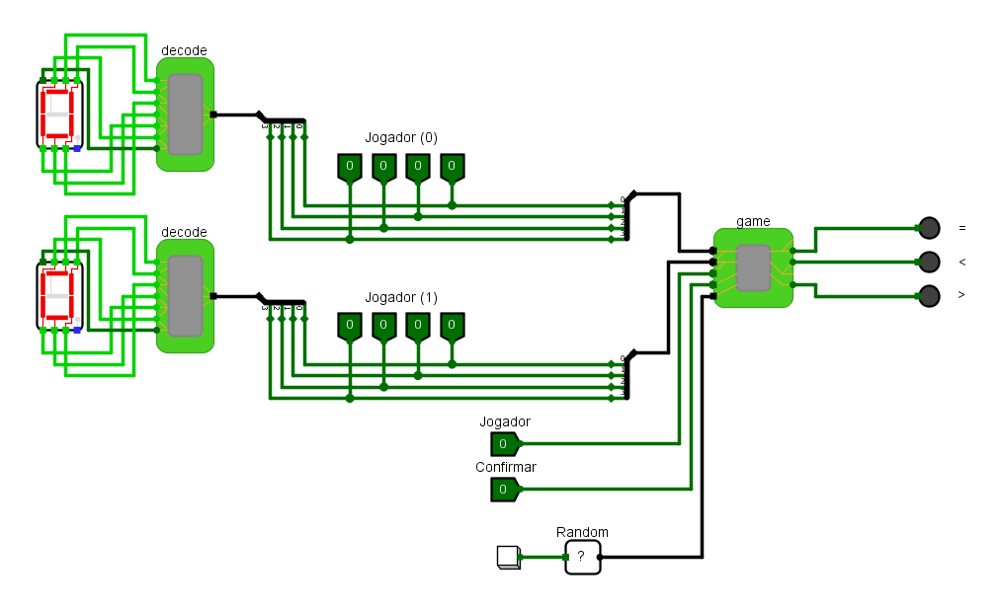

# Guess the Number

Participações:

- Claylton Demésio Muniz Silva - (Claylton-Muniz)
    
      [https://github.com/Claylton-Muniz](https://github.com/Claylton-Muniz)
    
- Paulo Victor Santos Souza - (PauloVict0r)
    
       [https://github.com/PauloVict0r](https://github.com/PauloVict0r)
    

## Main

Esse é o ***main*** do nosso projeto, sendo nele que realizamos as operações de jogo e visualização dos valores escolhidos pelo jogador no nosso display, valores que antes de serem mostrados no display são convertidos de binário para hexadecimal. Esse estágio, é também onde geramos um valor aleatório e exibimos se o palpite efetuado pelo jogador é superior, inferior ou equivalente ao escolhido pelo jogador.

## Game

Aqui no ***game***, cada bit recebido dos jogadores na classe anterior é armazenado individualmente em J0 e J1.Posteriormente, esses bits são encaminhados ao multiplexador (Mux), a fim de determinar qual das duas saídas será selecionada para a análise da magnitude (Mag).

## Mux

No multiplexador (Mux), empregamos um dispositivo controlador que possui um botão como entrada. Esse botão está conectado a duas portas "end", uma das quais é negada, enquanto a outra permanece normal. A essência desta configuração reside no fato de que, conforme determinado pelo jogador, uma das portas será logicamente avaliada como verdadeira. Isto resulta na transmissão exclusiva de valores verdadeiros provenientes do J0 ou J1, dependendo de qual porta “end” foi deixada como verdadeira em um dos lados.

## Mag

A porta ***xor*** é uma porta onde se os números são iguais, então temos como saída o valor verdadeiro. 

