# Guess the Number

Participações:

- Claylton Demésio Muniz Silva - (Claylton-Muniz)
    
    [https://github.com/Claylton-Muniz](https://github.com/Claylton-Muniz)
    
- Paulo Victor Santos Souza - (PauloVict0r)
    
    [https://github.com/PauloVict0r](https://github.com/PauloVict0r)
    

## Main

Esse é o ***main*** do nosso projeto, sendo nele que realizamos as operações de jogo e visualização dos valores escolhidos pelo jogador no nosso display, valores que antes de serem mostrados no display são convertidos de binário para hexadecimal. Esse estágio, é também onde geramos um valor aleatório e exibimos se o palpite efetuado pelo jogador é superior, inferior ou equivalente ao escolhido pelo jogador.

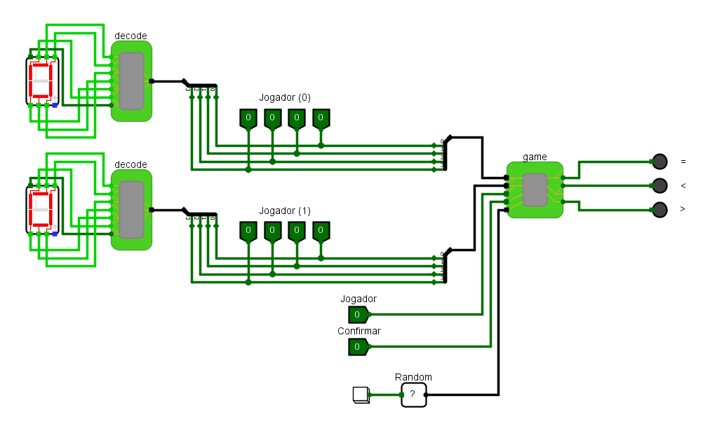

## Game

Aqui no ***game***, cada bit recebido dos jogadores na classe anterior é armazenado individualmente em J0 e J1.Posteriormente, esses bits são encaminhados ao multiplexador (Mux), a fim de determinar qual das duas saídas será selecionada para a análise da magnitude (Mag).

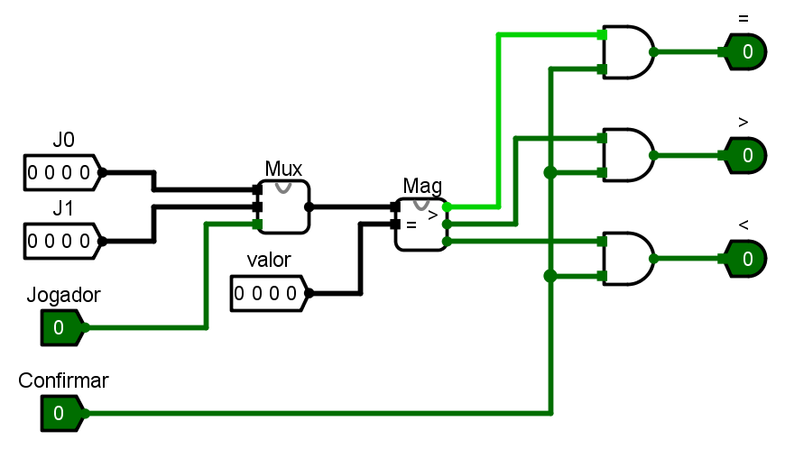

## Mux

No ***multiplexador*** (Mux), empregamos um dispositivo controlador que possui um botão como entrada. Esse botão está conectado a duas portas “end”, uma das quais é negada, enquanto a outra permanece normal. A essência desta configuração reside no fato de que, conforme determinado pelo jogador, uma das portas será logicamente avaliada como verdadeira. Isto resulta na transmissão exclusiva de valores verdadeiros provenientes do J0 ou J1, dependendo de qual porta “end” foi deixada como verdadeira em um dos lados.

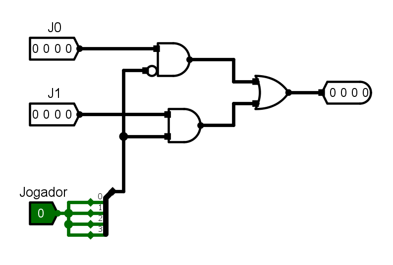

## Mag

A porta ***XOR*** é uma porta onde se os números são iguais, então temos como saída o valor verdadeiro.

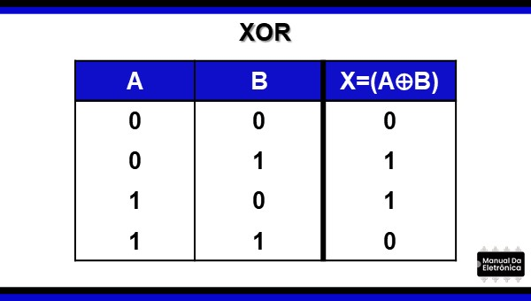

Conforme mencionado anteriormente, a porta lógica "XOR" é projetada de forma a gerar uma saída verdadeira apenas quando os valores de entrada forem idênticos. Dado que estamos lidando com um conjunto de 4 bits, empregamos quatro verificações distintas, cada uma utilizando uma porta "XOR", para determinar a igualdade entre esses valores. Paralelamente, realizamos quatro avaliações adicionais por meio de portas lógicas "AND". Nesse processo, verificamos a concordância dos bits mais significativos do bit em análise. Em seguida, comparamos o valor submetido a avaliação com o valor do bit alvo.

Para efetuar essa comparação, empregamos um esquema composto por uma entrada convencional e uma entrada negada. Através desse procedimento, asseguramos que o valor sendo comparado seja maior que o valor de referência. Exemplificando, consideremos a situação em que 1 é maior que 0. Nesse caso, o bit "1" passa sem modificação pela operação "AND", enquanto o bit "0" é submetido à entrada negada, garantindo que o resultado da operação "AND" seja igual a 1.

Por outro lado, a determinação da condição de menor valor envolve uma abordagem distinta. Nesse contexto, bastava verificar a não ocorrência das duas condições previamente mencionadas.

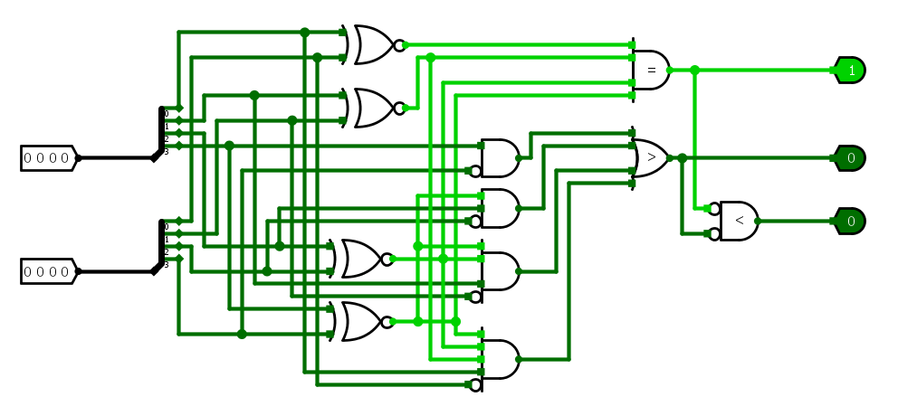

## Decode

A classe ***Decode*** tem a função de decidir quais partes devem estar ligadas. Para fazer isso, ela utiliza o mapa de Karnaugh, que é uma técnica para simplificar expressões lógicas. O processo envolve criar uma tabela com todas as combinações de entrada e saída, depois agrupar células semelhantes no mapa de Karnaugh e derivar expressões simplificadas. Essas expressões indicam quais partes devem estar ligadas, otimizando a implementação em circuitos digitais.

Para saber mais sobre o mapa de Karnaugh:

[https://mundoprojetado.com.br/mapa-de-karnaugh-aula-6-1-ed/](https://mundoprojetado.com.br/mapa-de-karnaugh-aula-6-1-ed/)

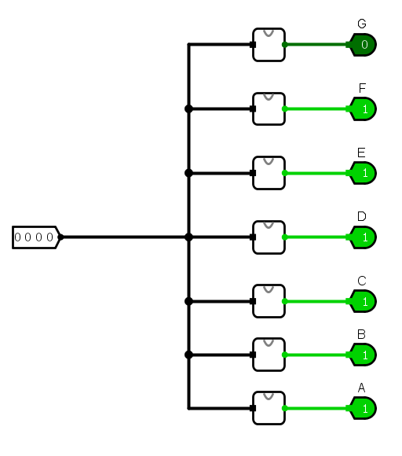

Cada decodificador se conecta a uma entrada de 4 bits e a sete saídas ligadas a um display de sete segmentos. Os quatros bits são analisados separadamente por cada segmento do A ao G (sete segmentos) que por sua vez, informam ao display se ele deve ou não estar acesso para a entrada recebida. O circuito de cada display foi criado com base na tabela verdade a seguir:

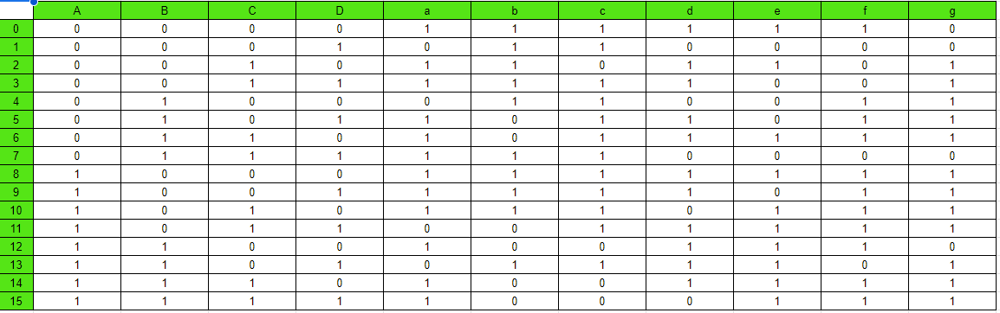

### Segmento A:

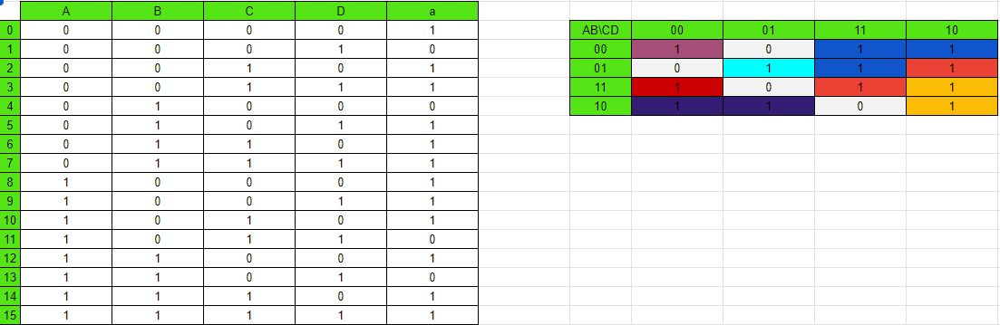

Circuito formado:

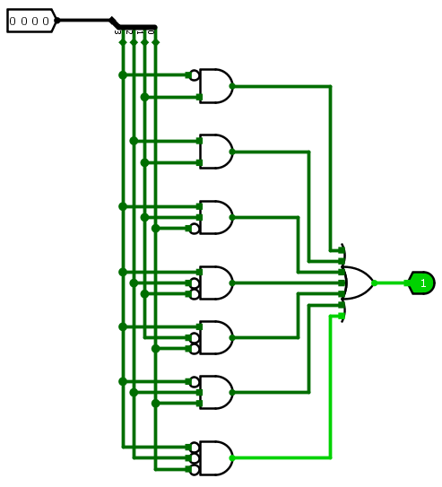

### Segmento B:

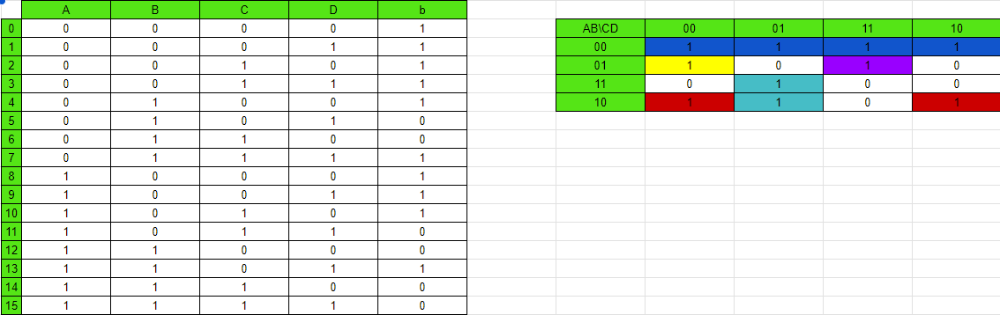

Circuito formado:

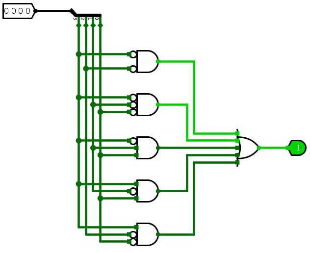

### Segmento C:

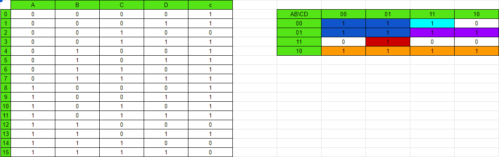

Circuito formado:

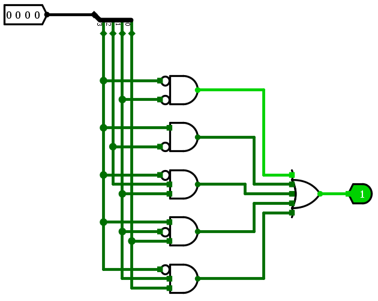

### Segmento D:

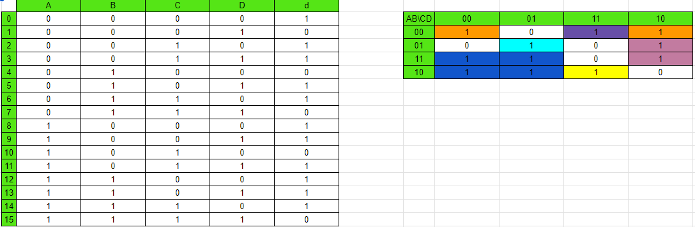

Circuito formado:

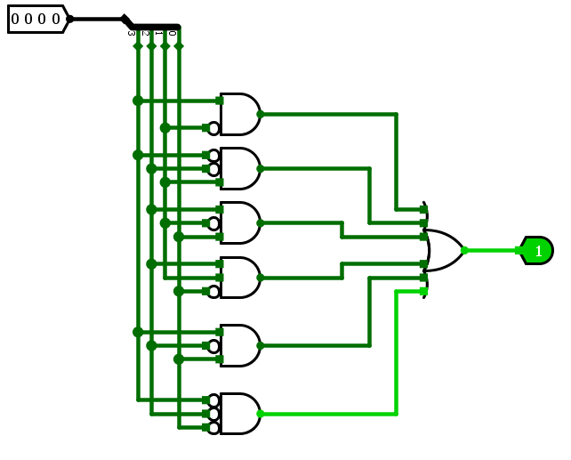

### Segmento E:

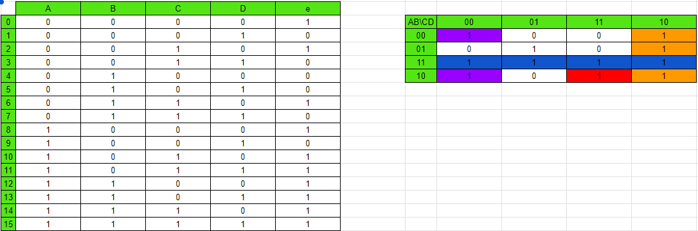

Circuito formado:

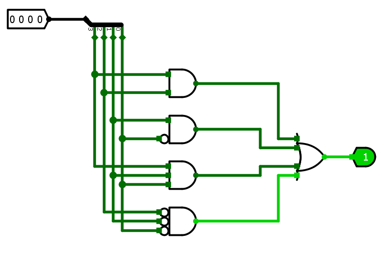

### Segmento F:

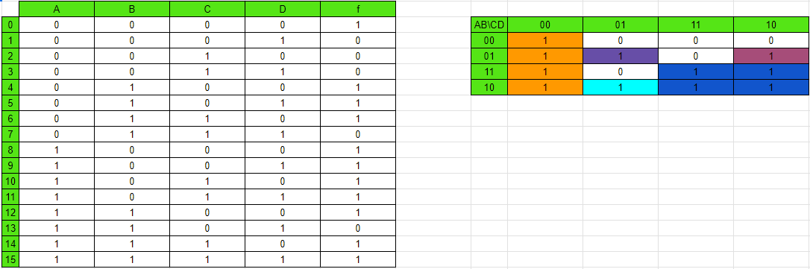

Circuito formado:

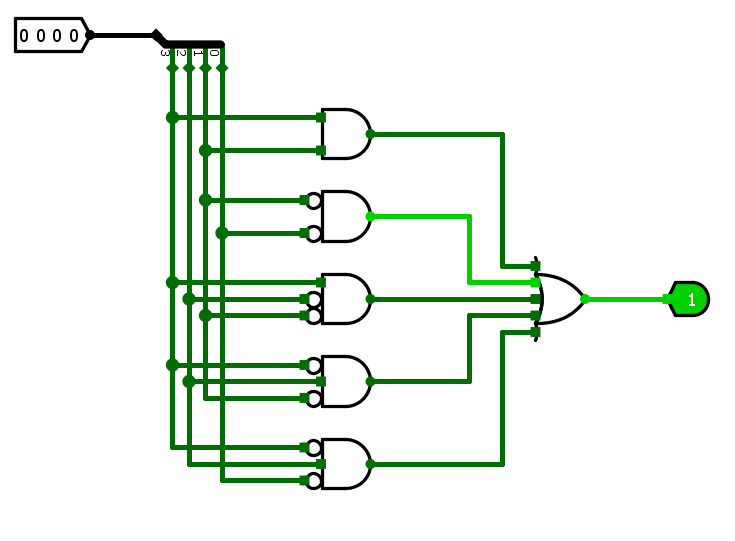

### Segmento G:

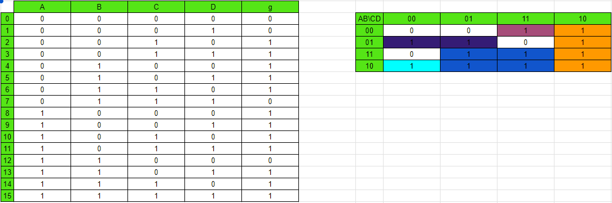

Circuito formado:

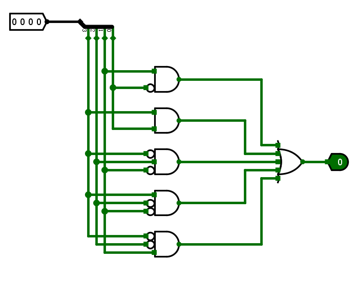